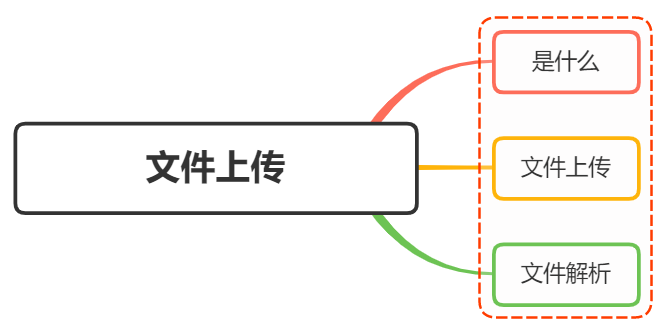

# `Node.js` 如何实现文件上传？实现思路



## 1. 是什么？

文件上传在日常开发中应用很广泛，比如说我们在网站上上传图片、上传视频等等，这些都是文件上传的应用场景

因为浏览器限制，浏览器不能直接操作文件系统，需要通过浏览器所暴露出来的统一接口，由用户主动授权发起来访问文件动作，然后读取文件内容进指定内存里，最后执行提交请求操作，将内存里的文件内容数据上传到服务端，服务端解析前端传来的数据信息后存入文件里

> multipart 互联网上的混合资源，就是资源由多种元素组成，form-data 表示可以使用 HTML Forms 和 POST 方法上传文件

<!-- ::: info multipart
multipart 互联网上的混合资源，就是资源由多种元素组成，form-data 表示可以使用 HTML Forms 和 POST 方法上传文件
::: -->

结构如下：

```js
POST /t2/upload.do HTTP/1.1
User-Agent: SOHUWapRebot
Accept-Language: zh-cn,zh;q=0.5
Accept-Charset: GBK,utf-8;q=0.7,*;q=0.7
Connection: keep-alive
Content-Length: 60408
Content-Type:multipart/form-data; boundary=ZnGpDtePMx0KrHh_G0X99Yef9r8JZsRJSXC
Host: w.sohu.com

--ZnGpDtePMx0KrHh_G0X99Yef9r8JZsRJSXC
Content-Disposition: form-data; name="city"

Santa colo
--ZnGpDtePMx0KrHh_G0X99Yef9r8JZsRJSXC
Content-Disposition: form-data;name="desc"
Content-Type: text/plain; charset=UTF-8
Content-Transfer-Encoding: 8bit

...
--ZnGpDtePMx0KrHh_G0X99Yef9r8JZsRJSXC
Content-Disposition: form-data;name="pic"; filename="photo.jpg"
Content-Type: application/octet-stream
Content-Transfer-Encoding: binary

... binary data of the jpg ...
--ZnGpDtePMx0KrHh_G0X99Yef9r8JZsRJSXC--
```

`boundary` 表示分割符，如果要上传多个表单项，就要是用 `boundary` 来分割，每个表单项都是以 `--xxx` 开始，以 `--xxx---` 结束

而 `xxx` 是即时生成的随机字符串，用以确保整个分割符不会在文件或表单项的内容中出现

每个表单项必须包含一个 `Content-Disposition` 头，其他的头信息则为可选，比如 `Content-Type`

`Content-Disposition` 包含了 `type` 和一个名字为 `name` 的 `parameter` ， `type` 是 `form-data` ， `name` 参数的值则为表单控件（也即 `fieId` ）的名字，如果是文件，那么还有一个 `filename` 参数，值是文件的名字

```js
Content-Disposition: form-data; name="user"; filename="logo.png"
```

至于使用 `multipart/form-data` ，是因为文件是以二进制的形式存在，起作用是专门用于传输大型二进制数据，效率高

## 2. 如何实现

关于文件的上传，我们可以分成两步骤：

- [文件的上传](#_2-1-文件上传)
- [文件的解析](#_2-2-文件解析)

### 2.1 文件上传

传统前端文件上传的表单结构如下：

```html
<form
  action="http://localhost:8080/api/upload"
  method="post"
  enctype="multipart/form-data"
>
  <input type="file" name="file" id="file" value="" multiple="multiple" />
  <input type="submit" value="提交" />
</form>
```

`action` 就是我们的提交到的接口， `enctype="multipart/form-data"` 就是指定的文件上传格式， `input` 的 `name` 属性一定要等于 `file`

### 2.2 文件解析

在服务器中，这里采用 `koa2` 中间件的形式解析上传的文件数据，分别有下面两种形式：

- [koa-body](#koa-body)
- [koa-multer](#koa-multer)

#### koa-body

安装依赖

```bash
npm install koa-body
```

引入 `koa-body` 中间件

```js
const koaBody = require("koa-body");
app.use(
  koaBody({
    multipart: true,
    formidable: {
      maxFileSize: 200 * 1024 * 1024, // 设置上传文件大小最大限制，默认2M
    },
  })
);
```

获取上传的文件

```js
const file = ctx.request.files.file; // 获取上传文件
```

获取文件数据后，可以通过 `fs` 模块将文件保存到指定目录

```js
router.post('/uploadfile', async (ctx,next)={
  // 上传单个文件
  const file = ctx.request.files.file; // 获取上传文件

  // 创建可读流
  const reader = fs.createReadStream(file.path);

  let filePath = path.join(__dirname, 'public/upload/') + `/${file.name}`;

  // 创建可写流
  const upStream = fs.createWriteStream(filePath);

  // 可读流通过管道写入可写流
  reader.pipe(upStream);
  return ctx.body = "上传成功！";
})
```

#### koa-multer

安装依赖

```bash
npm install koa-multer
```

使用 `multer` 中间件实现文件上传

```js
const multer = require("koa-multer");

const storage = multer.diskStorage({
  destination: (req, file, callback) => {
    callback(null, "./upload/");
  },
  filename: (req, file, callback) => {
    callback(null, Date.now() + path.extname(file.originalname));
  },
});

const upload = multer({ storage });

const fileRouter = new Router();

fileRouter.post("/upload", upload.single("file"), async (ctx, next) => {
  ctx.body = {
    filename: ctx.req.file.filename, //返回文件名
  };
});

app.use(fileRouter.routes());
```

## 4. 参考

- [formidable](https://github.com/node-formidable/formidable)
- [koa-body](https://github.com/koajs/koa-body)
- https://segmentfault.com/a/1190000037411957
- https://www.jianshu.com/p/29e38bcc8a1d
- https://vue3js.cn/interview/NodeJS/file_upload.html
